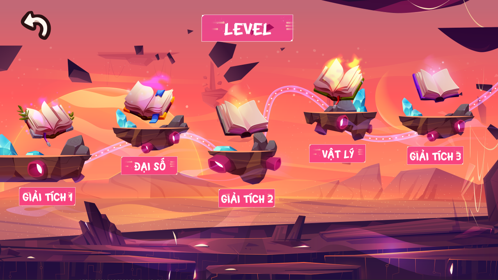

# Danh Bai Dai Cuong
A 3D casual  game made with Java, Libgdx by us (HUST students).
## Table of contents
* [General info](#general-info)
* [Technologies](#technologies)
* [Setup](#setup)

## General info
Demo video on Youtube: [link](https://www.youtube.com/watch?v=nYbOeGDG5VE&feature=youtu.be)

You can play the exported Jar file [here](https://drive.google.com/drive/folders/1r-f7cAncGnA4Fzlju-DhfZo7uWwSD3rD?usp=sharing) with Java installed on your desktop.

	
## Technologies
Project is created with:
* Java... (Yea, of course! 😂)
* Libgdx: (newest version now - July 2023 😂)
* Blender: 3.5

## Setup
TODO
